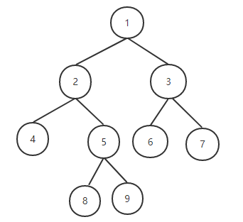

# 二叉树的下一个节点

> 给定一颗二叉树和其中一个节点，如何找出中序遍历序列的下一个节点？
> 树中的节点除了有两个分别指向左右子节点的指针，还有一个指向父节点的指针

图中二叉树中序遍历序列是{4, 2, 8, 5, 9, 1, 6, 3, 7}。




分析：
如果一个节点有右子树，那么它的下一个节点一点就是他的右子树中最左节点。也就是说，从右子节点出发一直沿着指向左子节点的指针，我们就能找到他的下一个节点。例如图中2节点的下一个节点是8， 5的下一个节点是9，1的下一个节点是6。

如果没有右子树，如果节点是它父节点的左子节点，那么它的下一个节点就是他的父节点。如果节点是它父节点的右子节点

```golang
func GetNext(node *Node) *Node {
	if node == nil {
		return nil
	}
	var next *Node
	if node.right != nil {
		next = node.right
		for next.left != nil {
			next = next.left
		}
	} else if node.parent != nil {
		cur := node
		parent := node.parent
		for parent != nil && cur == parent.right {
			cur = parent
			parent = parent.parent
		}
		next = parent
	}
	return next
}
```